# Core module verification

This page checks the `core_module` core boundary condition ([core_bc.md](core_bc.md)) and the `aragog.core` model behind it against analytic results, published values, an independent core evolution code and coupled runs. Each section states the physics a check tests, the reference and where it comes from, the value aragog gives, a figure, and the tests that pin it. A check shows that the code solves the stated equations to the stated accuracy; whether the equations describe a real core is a separate question, which the literature comparisons in sections 5 to 8 and the limits stated with each check address.

Every number on this page and every figure is produced by `tools/verification/run_core_verification.py`, which writes the figures to `docs/figures/vv/` and the numbers to `docs/figures/vv/core_verification_values.json`; `tests/test_core_verification_page.py` checks each number on the page against that file. The script needs the SPIDER-format EOS tables (`ARAGOG_TEST_EOS_DIR`) for sections 9 and 12 and the optional `verification` dependencies for the figure style, and runs in about eight minutes on one core. Nimmo (2015) is chapter 8.02 of the *Treatise on Geophysics* wherever chapter 9.08 is not named.

## 1. Gaussian core structure

The core density is a Gaussian in radius, $\rho(r) = \rho_\mathrm{cen} \exp(-r^2/L^2)$, and the adiabat is $T_a(r) = T_\mathrm{cmb} \exp((r_\mathrm{cmb}^2 - r^2)/D^2)$ with $D^2 = 3 c_p / (2\pi \alpha \rho_\mathrm{cen} G)$ (Labrosse et al. 2001, eqs. 7 and 11, the adiabat to the same order in radius as their density and gravity, eq. 8). Mass and gravity are closed-form integrals of the density; the pressure is the hydrostatic integral of $\rho g$ from the CMB inward, by 32-point Gauss-Legendre quadrature (`pressure_mode = "quadrature"`), or the third-order expansion in $r/L$ that Labrosse et al. (2001, eq. 8) use for gravity (`pressure_mode = "labrosse"`).

On the Earth-like test core ($\rho_\mathrm{cen} = 12500$ kg m$^{-3}$, $L = 7200$ km, $r_\mathrm{cmb} = 3480$ km), the closed-form enclosed mass and gravity agree with an independent adaptive quadrature of the density to 3.6e-13<!--k:1.mass_rel_err-->, and gravity near the centre follows the linear limit $4\pi G \rho_\mathrm{cen} r/3$ to 2.2e-16<!--k:1.gravity_centre_slope_rel_err-->. The pressure satisfies $dP/dr = -\rho g$ to 2.5e-08<!--k:1.hydrostatic_max_rel_err-->, the error of the 50 m central difference used to test it. The core has a mass of 1.92e+24<!--k:1.m_core--> kg, a CMB density of 9896<!--k:1.rho_cmb--> kg m$^{-3}$ and a central pressure of 356.8<!--k:1.p_cen_GPa--> GPa. The third-order pressure differs from the quadrature by up to 3.0e-03<!--k:1.pressure_lab_vs_quad_max_rel-->, the truncation of the expansion; both meet the CMB anchor exactly.

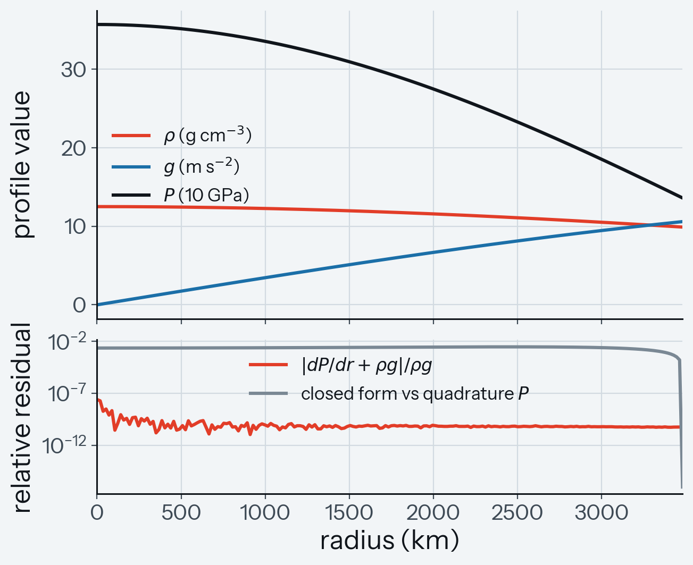

**Figure 8.** Gaussian core structure of the Earth-like test core. (a) Density, gravity and pressure against radius. (b) Relative residual of hydrostatic balance $|dP/dr + \rho g|/\rho g$ for the quadrature pressure, and the relative difference between the third-order and the quadrature pressure; both panels share the radius axis.

Pinned by `tests/test_core_profiles.py::test_density_positive_monotone_and_mass_matches_quadrature`, `::test_gravity_centre_limit_and_shell_integral` and `::test_pressure_hydrostatic_balance_and_anchor`.

## 2. Energy identities of the core budget

The core cools at $dT_\mathrm{cmb}/dt = -(Q_\mathrm{cmb} - Q_\mathrm{radio}) / \tilde C(T_\mathrm{cmb})$, where the effective capacity $\tilde C = C_s + C_L + C_g$ adds the secular term, the latent heat of inner-core growth and the gravitational energy of the light elements it rejects. The heat content $H(T)$ is defined so that $H(T_2) - H(T_1) = \int_{T_1}^{T_2} \tilde C\, dT$; the solver books the core heat change from it, so this identity is what ties the core ledger to the CMB heat. Inner-core growth starts at the onset temperature $T_\mathrm{on}$, where the adiabat first touches the melting curve at the centre, and ends at freeze-out $T_\mathrm{fr}$, where the whole core has crystallised and the latent and gravitational terms vanish.

For the iron-alloy curve on the test core, onset is at 4054.2<!--k:2.t_onset--> K and freeze-out at 3688.9<!--k:2.t_freeze--> K. The heat-content difference matches the integral of $\tilde C$ to 4.0e-07<!--k:2.content_vs_integral_max_rel--> of the total over 150 K on either side of the growth band, the CMB temperatures from the onset to the freeze-out, where the inner core grows; the residual above the onset is the trapezoid error of the 40001-point reference at the square-root cusp of the latent term, not an error of $H$. At freeze-out the capacity drops by a factor of 4.460<!--k:2.quadratic_freeze_out_ratio--> for the Nimmo (2015) quadratic curve and by 55.2 %<!--k:2.iron_freeze_out_drop:-100--> for the iron-alloy curve, without the gravitational term.

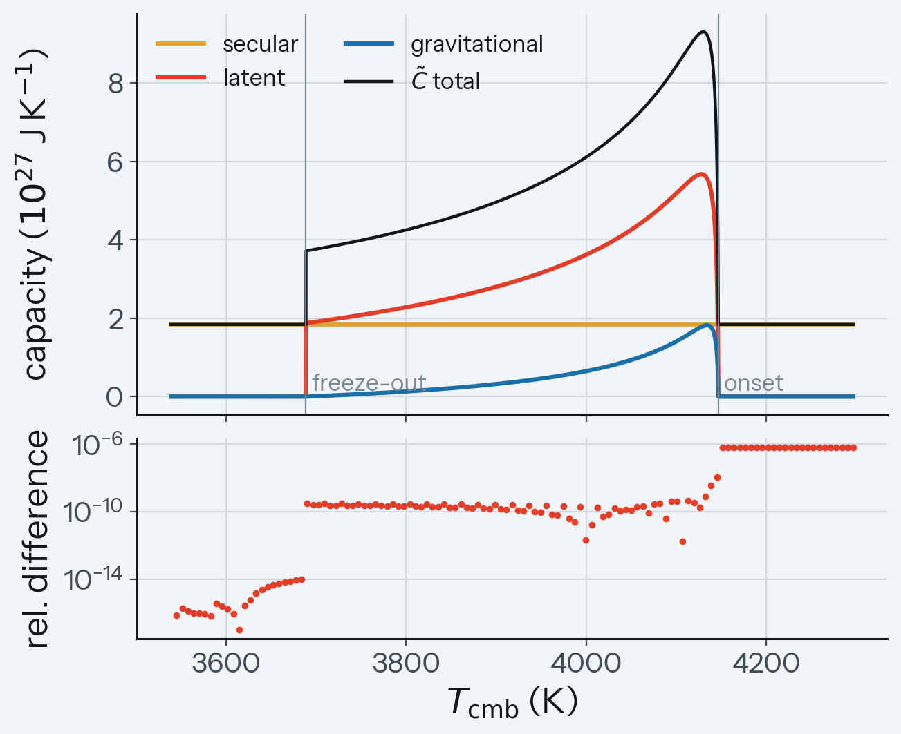

**Figure 9.** Effective heat capacity of the core across inner-core growth. (a) Secular, latent and gravitational capacities and their sum against CMB temperature, with the onset and freeze-out marked. (b) Relative difference between the heat-content difference and the integral of the total capacity at 120 temperatures, normalised by the total.

Pinned by `tests/test_core_budget.py::test_heat_content_difference_is_the_capacity_integral`, `::test_latent_and_gravitational_energy_conservation` (latent and gravitational capacities integrate to the geometric latent heat and gravitational energy to below 1e-6) and `::test_freeze_out_capacity_jump`.

## 3. CMB boundary-layer flux

The CMB heat flux is $q = k\, \Delta T / \min(\Delta r_{1/2}, \delta)$ for a core hotter than the mantle side of the CMB, where $\Delta T = T_\mathrm{core} - T_m$, $\Delta r_{1/2}$ is the distance to the bottom mantle cell and $\delta = (\kappa \eta\, Ra_\mathrm{crit} / (\rho g \alpha \Delta T))^{1/3}$ is the boundary-layer thickness at the critical Rayleigh number (Foley & Driscoll 2016, eq. 20 and the text below it; Thiriet et al. 2019, eqs. 13 and 14). On the convective branch $q \propto \Delta T^{4/3}$; a core colder than the mantle gains heat by conduction across the half cell only, so the flux always has the sign of $\Delta T$. The default $Ra_\mathrm{crit} = 450$ is the critical value Thiriet et al. (2019, Table 2) use for the upper boundary layer of their mantle; for the lower boundary layer they scale it with the internal Rayleigh number (their eq. 16), so here it is a parameter, `ra_crit_cmb`.

For a bottom cell with $k = 4$ W m$^{-1}$ K$^{-1}$, $\rho = 4000$ kg m$^{-3}$, $c_p = 1000$ J kg$^{-1}$ K$^{-1}$, $\alpha = 3\times10^{-5}$ K$^{-1}$, $g = 10$ m s$^{-2}$ and $\Delta r_{1/2} = 10$ km over a liquid base ($\eta = 0.1$ Pa s), the convective branch has the slope 1.333<!--k:3.convective_slope--> in log-log and $Ra_\mathrm{crit} = 1800$ lowers the flux by the factor 0.630<!--k:3.ra_crit_ratio_1800_450--> $= (450/1800)^{1/3}$. At a 100 K contrast the flux is 5.55e+04<!--k:3.q_liquid_100K--> W m$^{-2}$ over the liquid base and 0.04<!--k:3.q_solid_100K--> W m$^{-2}$ over a solid base ($\eta = 10^{21}$ Pa s), where conduction across the half cell sets it; a colder core conducts at the same rate over either base, to 4.2e-15<!--k:3.cold_core_flux_equals_solid_base-->.

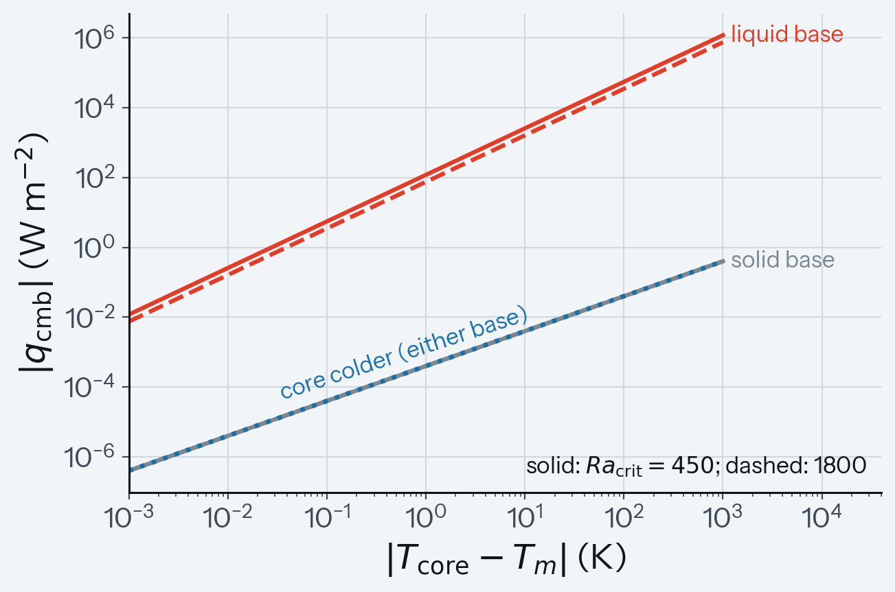

**Figure 10.** Magnitude of the CMB heat flux against the core-mantle temperature contrast, for a liquid and a solid bottom cell with the properties of section 3, at $Ra_\mathrm{crit} = 450$ (solid) and 1800 (dashed); the dotted line is a core colder than the mantle, which conducts across the half cell over either base.

Pinned by `tests/test_core_boundary_layer.py` (sign, hand-computed convective value, conduction branch, $Ra_\mathrm{crit}$ scaling, continuity and slopes through zero contrast).

## 4. Inner-core nucleation

The inner-core radius $r_\mathrm{icb}(T_\mathrm{cmb})$ is the radius where the adiabat crosses the melting curve. The adiabat and the melting curve both have zero radial slope at the centre, so just below the onset their difference is quadratic in $r$ and $r_\mathrm{icb} \propto (T_\mathrm{on} - T_\mathrm{cmb})^{1/2}$: $r_\mathrm{icb}^2$ grows at a finite rate per kelvin, and $dr_\mathrm{icb}/dT_\mathrm{cmb}$ diverges at the onset. The budget's latent and gravitational capacities need $dr_\mathrm{icb}/dT_\mathrm{cmb}$, which the code supplies by the implicit-function theorem as a custom derivative rule.

Fitted over the first kelvin of undercooling, the log-log slope is 0.4993<!--k:4.sqrt_slope-->. The implicit-function derivative agrees with a central difference with a step of $10^{-3}$ of the undercooling to 1.4e-06<!--k:4.jvp_vs_fd_max_rel--> from $10^{-3}$ to 30 K below the onset.

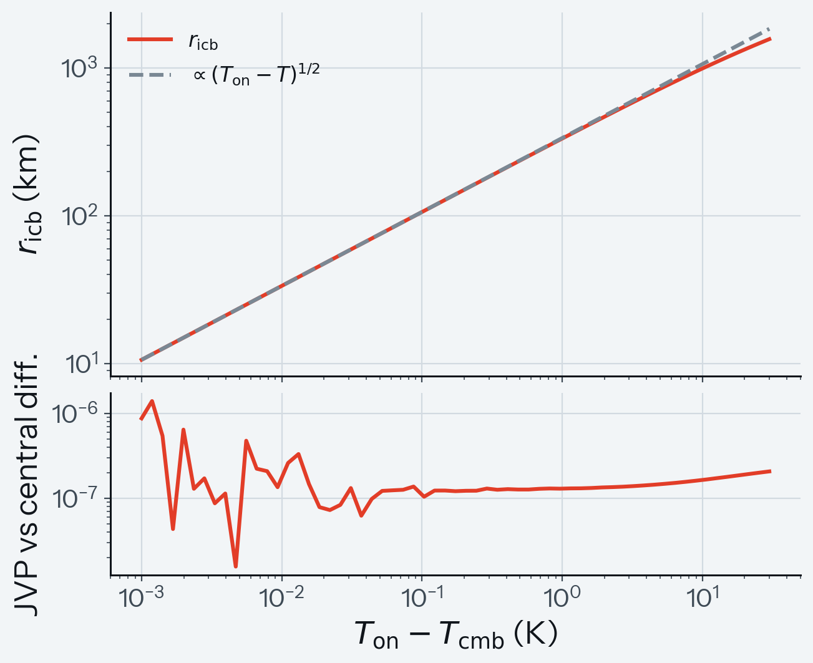

**Figure 11.** Inner-core growth below the onset. (a) Inner-core radius against undercooling, with the square-root law through the first point. (b) Relative difference between the implicit-function derivative and a central difference.

Pinned by `tests/test_core_verification_page.py::test_inner_core_radius_grows_as_the_square_root_of_undercooling` and `tests/test_jax_dsdt_core_module.py::test_jacobian_core_column_matches_central_differences`.

## 5. Nimmo (2015) Earth core budget

Nimmo (2015, Table 2, p. 42) gives one parameter set for Earth's core (central density 12500 kg m$^{-3}$, $L = 7272$ km, a CMB pressure of 139 GPa, $\alpha = 1.25\times10^{-5}$ K$^{-1}$, $k = 130$ W m$^{-1}$ K$^{-1}$, the quadratic melting curve with $T_{m0} = 2677$ K, $T_{m1} = 2.95\times10^{-12}$ Pa$^{-1}$, $T_{m2} = 8.37\times10^{-25}$ Pa$^{-2}$, a latent heat of 750 kJ kg$^{-1}$ and a light-element density jump of 560 kg m$^{-3}$), and Table 4 (p. 46) the present-day energy and entropy budget at $T_c = 4180$ K for CMB heat flows of 15.2 and 12 TW without radiogenic heat. On aragog's Gaussian core with the third-order pressure, these inputs put the inner-core boundary at 1209<!--k:5.r_icb_km--> km and 328.5<!--k:5.p_icb_GPa--> GPa at 4180 K, against the 1220 km and 328 GPa of Table 2.

At 15.2 TW and 4180 K:

| quantity | Nimmo (2015) | aragog |
|---|---|---|
| $Q_s$, $Q_L$, $Q_g$ (TW) | 6.1, 5.7, 3.4 | 6.06<!--k:5.Qs_15.2TW-->, 5.71<!--k:5.QL_15.2TW-->, 3.43<!--k:5.Qg_15.2TW--> |
| $Q_k$ (TW) | 15.0 | 14.97<!--k:5.Qk_15.2TW--> |
| $E_s$, $E_L$, $E_g$, $-E_k$ (MW K$^{-1}$) | 183, 327, 809, 450 | 182<!--k:5.Es_15.2TW-->, 330<!--k:5.EL_15.2TW-->, 820<!--k:5.Eg_15.2TW-->, 451<!--k:5.Ek_15.2TW--> |
| $-dT_c/dt$ (K Gyr$^{-1}$) | 104 | 103.3<!--k:5.cooling_15.2TW--> |
| $dr_\mathrm{icb}/dt$ (km Gyr$^{-1}$) | 1050 | 1075<!--k:5.growth_15.2TW--> |

Every energy and entropy term and the cooling rate agree to 1.3 percent at both heat flows (at 12 TW the cooling rate is 81.6<!--k:5.cooling_12TW--> against 82 K Gyr$^{-1}$). The inner core grows 2.4 percent faster, as aragog's $|dr_\mathrm{icb}/dT_c|$ is 10406<!--k:5.Cr_m_per_K--> m K$^{-1}$ against $C_r = 10100$ m K$^{-1}$ (Table 2). The CMB temperature has dropped by 59.3<!--k:5.delta_t_onset_K--> K since the onset, against about 60 K (p. 43), and the melting temperature at the centre is 5808<!--k:5.tm_centre_K--> K against 5800 K (Table 5).

Table 5 (p. 46) gives the energy released since the onset, $23\times10^{28}$ J (secular 11.6, latent 6.9, gravitational 4.4), and from it an inner-core age of 0.73 Gyr under a constant 10 TW. Integrating aragog's capacities from 4180 K to the onset gives 22.2<!--k:5.Wtot_1e28J--> (10.98<!--k:5.Ws_1e28J-->, 6.83<!--k:5.WL_1e28J--> and 4.42<!--k:5.Wg_1e28J-->) $\times10^{28}$ J and 0.70<!--k:5.age_10TW_Gyr--> Gyr; the secular term, the secular capacity times the drop, is 5 percent lower. The ages of Table 4, 0.59 and 0.75 Gyr, are not this integral: in our reading they are the drop since the onset times the present $\tilde Q_T = Q_\mathrm{cmb}/(-dT_c/dt)$, over the heat flow, which on the numbers of Table 4 ($4.6\times10^{27}$ J K$^{-1}$) and a 60 K drop gives 0.58 and 0.73 Gyr, within 3 percent of the table. The same quotient on aragog's state gives 0.574<!--k:5.age_linear_15.2TW--> and 0.727<!--k:5.age_linear_12TW--> Gyr, and the integral 0.464<!--k:5.age_15.2TW--> and 0.587<!--k:5.age_12TW--> Gyr, shorter because the latent and gravitational capacities rise from zero at the onset.

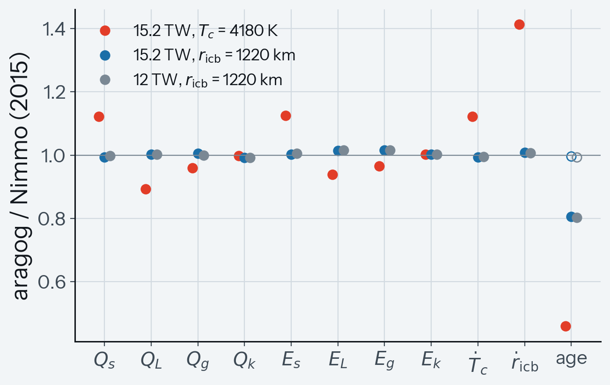

**Figure 12.** Ratio of aragog to Nimmo (2015, Table 4) at $T_c = 4180$ K for 15.2 and 12 TW: the energy and entropy terms, the cooling and inner-core growth rates and the inner-core age. Filled circles give aragog's age as the integral of its capacity to the onset, open circles as the drop since the onset over the present cooling rate.

Pinned by `tests/test_core_nimmo_benchmarks.py` (the adiabat length scale, ICB state, adiabatic heat flow and $C_r$ of the two models in Nimmo 2015, ch. 9.08, Table 2, and the ICB pressure and $\tilde Q_T$ of ch. 8.02) and `tests/test_core_verification_page.py::test_page_numbers_match_the_values`.

## 6. Budget terms against thermal_history

The `leeds` core model of thermal_history (Greenwood et al. 2021) computes the same budget with polynomial profiles, a trapezoid quadrature on a radial grid and its own inner-core growth. The comparison runs it on the Nimmo (2015, Table 2) core, with the Gaussian density and adiabat given to it as the first 8 terms of their Taylor series in $r^2$ (degree 14), the same quadratic melting curve without a light-element depression, a fixed latent heat of 750 kJ kg$^{-1}$, complete rejection of the light element at the inner-core boundary, and the CODATA gravitational constant aragog uses. A core-only history starts at a CMB temperature of 4400 K under a fixed CMB heat flow of 10 TW; aragog's capacities are evaluated on each thermal_history state. Inputs, versions and licence are in `tools/verification/data/`.

The secular term agrees to 1.4e-08<!--k:6.secular_max_rel--> and the conduction entropy sink to 1.5e-07<!--k:6.conduction_sink_rel-->; the latent term agrees to 6.1e-04<!--k:6.latent_max_rel-->. The gravitational term differs by up to 3.8 %<!--k:6.gravitational_max_rel:100-->, because thermal_history enriches the outer core in the light element as the inner core grows (by the factor 1.039<!--k:6.enrichment_end--> at the end), while aragog holds the composition fixed; with that factor applied the two agree to 6.1e-04<!--k:6.gravitational_enrichment_corrected_max_rel-->.

The stratified layer is compared with thermal_history in [section 13](#13-stable-layer-against-thermal_history).

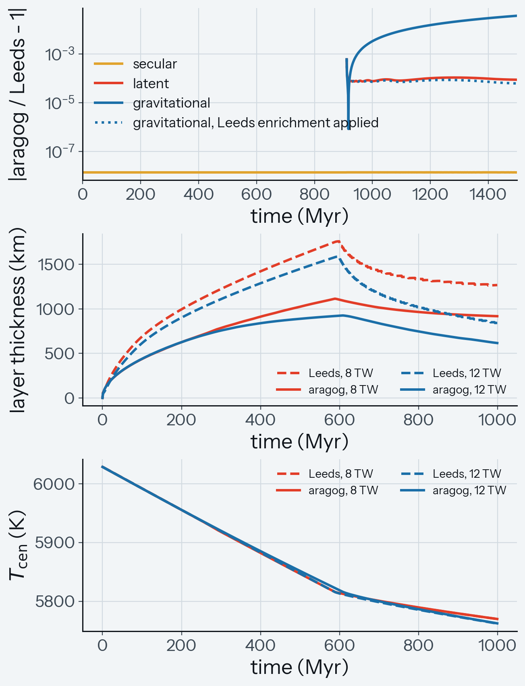

**Figure 13.** Relative difference of aragog's secular, latent and gravitational capacities from those of the `leeds` model of thermal_history along its 10 TW history on the same inputs; the dotted line applies thermal_history's outer-core enrichment to aragog's gravitational term.

Pinned by `tests/test_core_verification_page.py::test_budget_terms_match_the_thermal_history_table`, and on the Nimmo (2015) state by `tests/test_core_nimmo_benchmarks.py::test_budget_terms_match_thermal_history_cross_check` and `tests/test_core_entropy.py::test_entropy_capacities_match_thermal_history`.

## 7. Dynamo criterion and field strength

The entropy budget gives the entropy production available to the dynamo, $\Delta E = E_s + E_L + E_g + E_R - E_k$, positive when the core can sustain a dynamo. The field strength follows the energy-flux scaling of Christensen et al. (2009, eq. 2), $\langle B \rangle^2/(2\mu_0) = c f_\mathrm{ohm} \langle \rho \rangle^{1/3} (F q_o)^{2/3}$ with $c = 0.63$ and the efficiency factor $F = 0.88\, \alpha g_\mathrm{cmb} r_\mathrm{cmb} / c_p$ for a constant total heat flow $4\pi r^2 q_c$ or $0.45\, \alpha g_\mathrm{cmb} r_\mathrm{cmb} / c_p$ for a convected flux that vanishes at the outer boundary (p. 168). Christensen et al. derive these factors for Earth's core with an inner core of 0.35 of the core radius, $L = D$, constant density and thermodynamic properties and gravity linear in radius (pp. 167 and 168); aragog applies them at every inner-core size. Their $q_o$ is the effective convected flux at the inner boundary, compositional driving included, scaled to the outer radius (p. 167); aragog takes the superadiabatic part of the CMB heat flow over the CMB area, a thermal flux only, so here $q_o$ departs from their definition. With $f_\mathrm{ohm} = 1$, the upper end of $f_\mathrm{ohm} \le 1$ (p. 167), the field is the largest the scaling allows for that flux.

With Christensen et al.'s Earth inputs ($\alpha = 1.35\times10^{-5}$ K$^{-1}$, $g = 10.7$ m s$^{-2}$, $R = 3480$ km, $c_p = 840$ J kg$^{-1}$ K$^{-1}$) the two factors are 0.527<!--k:7.F_const_flux_printed_inputs--> and 0.269<!--k:7.F_zero_outer_printed_inputs-->, against the printed 0.52 and 0.27; on the Nimmo (2015) core the constant-flux factor is 0.484<!--k:7.F_const_flux_profile-->, lower mainly through the lower expansivity ($1.25\times10^{-5}$ K$^{-1}$; the CMB gravity, 10.6 m s$^{-2}$, accounts for under 1 percent). On that core at $T_\mathrm{cmb} = 4180$ K the adiabatic heat flow is 14.97<!--k:7.Q_k_TW--> TW and the entropy margin vanishes at 5.14<!--k:7.dynamo_threshold_TW--> TW, against Nimmo's (2015, p. 46) minimum of about 5 TW for a present-day dynamo without radiogenic heat. Between these two heat flows the margin is positive but no flux is superadiabatic, so the field estimate is zero although the entropy budget allows a dynamo. At 17 TW the core field is 1.10<!--k:7.b_rms_17TW_mT--> mT, the order of magnitude of the 1.82<!--k:7.earth_internal_field_mT--> mT for Earth from Christensen et al.'s dipole field of 0.26 mT at the dynamo surface and their ratio of about 7 between the total and the dipole field (p. 168); with $q_o$ defined differently, this is an order-of-magnitude check only.

The efficiency factors of $\Delta E$ use $T_\mathrm{cmb}$, the convecting adiabat extended to the CMB. Under a stratified layer the reference of the whole-core entropy balance is the actual CMB temperature (Greenwood et al. 2021, eq. 4 and p. 9), which aragog does not resolve and which lies between $T_\mathrm{cmb}$ and $T_a(r_s)$ at the base of the layer; $\Delta E$ is then the upper end of that bracket ([core_bc.md](core_bc.md)).

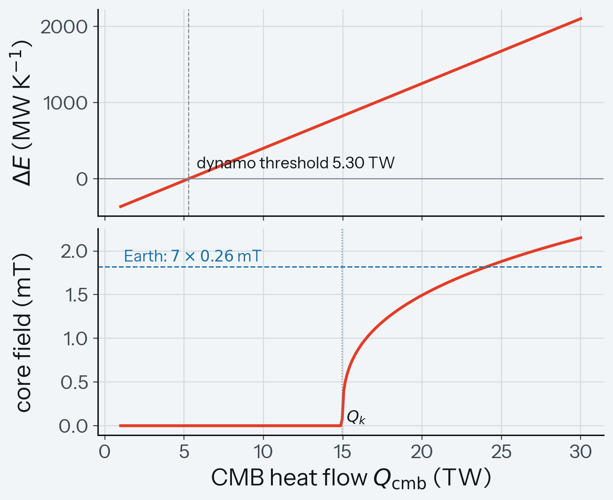

**Figure 14.** Dynamo criterion and field strength on the Nimmo (2015) core at $T_\mathrm{cmb} = 4180$ K. (a) Entropy margin against CMB heat flow, with the threshold where it vanishes. (b) Volume-averaged core field from Christensen et al. (2009, eq. 2), with Earth's estimated internal field. The field is zero up to the adiabatic heat flow $Q_k$, 15.0<!--k:7.Q_k_TW--> TW, so also from 5.1<!--k:7.dynamo_threshold_TW--> TW, where the margin turns positive, to $Q_k$.

Pinned by `tests/test_core_entropy.py::test_chr09_efficiency_factors_reproduce_printed_values`, `::test_field_scaling_bounds_and_earth_magnitude` and `::test_dynamo_threshold_and_margin`.

## 8. Iron melting curve

The pure-iron melting curve is the two-branch Simon-Glatzel fit of Anzellini et al. (2013, eqs. 2 and 3, p. 466), $(P - P_0)/27.39 = (T_m/T_0)^{2.38} - 1$ on the $\gamma$-Fe branch with $T_0 = 1991$ K and $P_0 = 5.2$ GPa, and $(P - P_\mathrm{TP})/161.2 = (T_m/T_\mathrm{TP})^{1.72} - 1$ on the $\epsilon$-Fe branch from the $\gamma$-$\epsilon$-liquid triple point at 98.5 GPa and 3712 K; this is the PALEOS prescription. The two branches meet with a jump of 0.725<!--k:8.branch_jump_K--> K at the triple point, which a $C^2$ smootherstep over a 3 GPa half-width removes; the blended curve departs from the branches by at most 0.361<!--k:8.blend_max_dev_K--> K and equals them exactly outside the blend. Light elements depress the curve by the factor $1 - \mathrm{depression} \times x$, 0.88<!--k:8.depression_factor--> for $x = 0.1$ and a depression of 1.2; this depression is a model choice, not part of the Anzellini fit.

The pure-iron curve gives 4192.0<!--k:8.t_melt_136GPa--> K at 136 GPa and 6229.2<!--k:8.t_melt_330GPa--> K at 330 GPa.

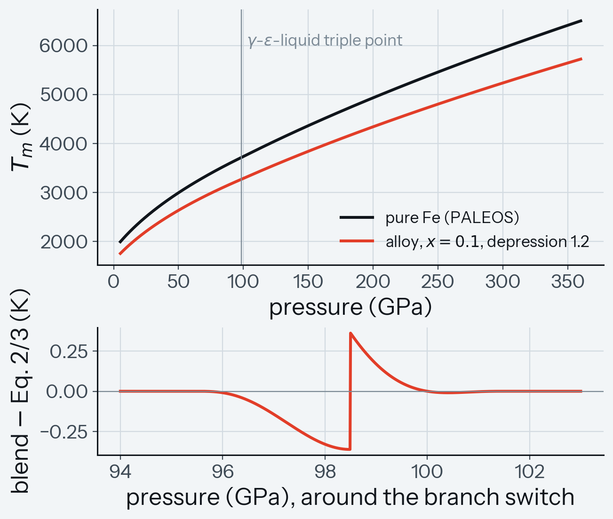

**Figure 15.** Iron melting curve. (a) Pure-iron and alloy melting temperature against pressure, with the triple point marked. (b) Blended curve minus the unblended Anzellini et al. (2013) branches around the triple point; the jump is that of the unblended fit.

Pinned by `tests/test_core_melting.py::test_pure_iron_pins_against_the_paleos_source`, `::test_branch_switch_matches_unblended_outside_transition` and `::test_branch_switch_deviation_and_c1_continuity`.

## 9. A CVODE solve across the inner-core onset

The coupled right-hand side carries the core temperature as a state, so CVODE integrates the core through the onset, where the latent capacity rises as a square root. With the quadratic melting curve of section 5 at 1.5 times its $T_{m0}$ (4015.5 K), which puts the onset above the mantle base, a core 2 K above the onset over a liquid mantle base cools from 6271.3<!--k:9.t_core_start--> K to 6268.3<!--k:9.t_core_end--> K in 4 yr, through the onset at 6269.3<!--k:9.t_onset--> K, and grows an inner core of 148<!--k:9.r_icb_end_km--> km. At a solver rtol of $10^{-10}$ (atol stays at its floor of $10^{-8}$) the solver's core heat change matches the heat-content difference to 3.7e-13<!--k:9.core_vs_content_rel--> and the CMB heat it books to 6.2e-07<!--k:9.core_vs_cmb_rel-->, within the bound of $10^{-6}$ for a core solved alone; at the default rtol of $10^{-8}$ the CMB heat matches to 1.4e-06<!--k:9.core_vs_cmb_rel_rtol1e-8-->, so a call across the onset needs the tighter tolerance to meet that bound; the CMB heat reconstructed from the 71<!--k:9.n_outputs--> output times by the trapezoid rule matches to 7.5e-04<!--k:9.reconstructed_cmb_max_rel-->, the error of that sampling.

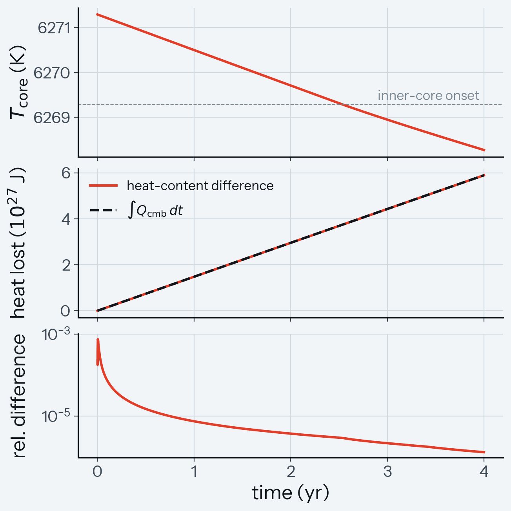

**Figure 16.** A CVODE solve through the inner-core onset. (a) Core temperature against time, with the onset temperature. (b) Core heat lost from the heat-content difference and from the time integral of the CMB heat flow. (c) Relative difference between the two curves in (b).

Pinned by `tests/test_entropy_solver_core_module_smoke.py::test_core_module_cvode_solve_crosses_the_inner_core_onset`.

## 10. A core thermal history against thermal_history

The core-only history of section 6 tests the integrated evolution rather than the terms: aragog integrates its cooling rate under the same fixed 10 TW CMB heat flow by an implicit solver with a relative tolerance of $10^{-10}$, and thermal_history steps it with its own fixed 1 Myr steps. Over 1499<!--k:10.t_end_myr--> Myr the CMB temperatures differ by at most 0.119<!--k:10.t_cmb_max_abs_diff--> K. The inner core nucleates at 911<!--k:10.onset_myr_aragog--> Myr in aragog and at 911<!--k:10.onset_myr_leeds--> Myr in thermal_history, on its 1 Myr grid, and reaches 1122.8<!--k:10.r_icb_end_km_aragog--> km against 1121.4<!--k:10.r_icb_end_km_leeds--> km, an inner-core age of 588<!--k:10.inner_core_age_myr--> Myr in both. Before the onset they agree to 2.2e-06<!--k:10.t_cmb_max_abs_diff_before_onset--> K. The difference appears at the onset, 6.5e-04<!--k:10.t_cmb_abs_diff_at_onset--> K at the first step, rises to 0.024<!--k:10.t_cmb_diff_max_after_onset_K--> K, changes sign at 1196<!--k:10.sign_change_myr--> Myr and reaches its largest magnitude at the end, at 1499<!--k:10.t_cmb_max_abs_diff_myr--> Myr (aragog minus thermal_history throughout). We attribute the jump at the onset to thermal_history's explicit step, which crosses the start of the latent release in one step, and the later drift to the outer-core enrichment of section 6, which shifts the gravitational term; neither cause is tested separately.

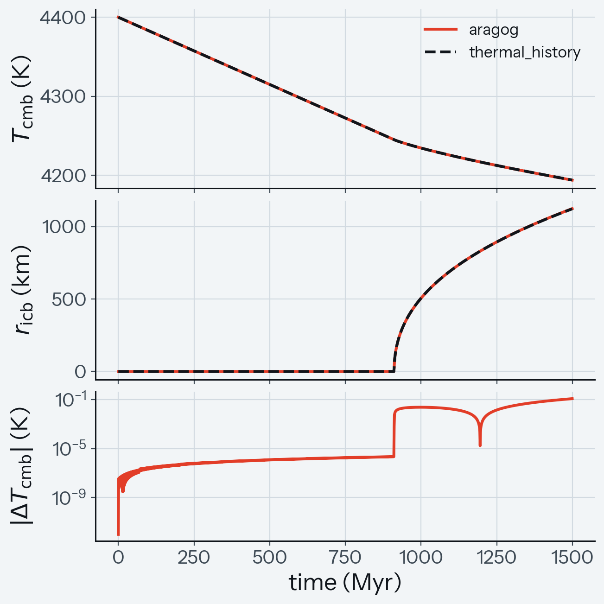

**Figure 17.** Core-only thermal history under a fixed 10 TW CMB heat flow. (a) CMB temperature from aragog and thermal_history. (b) Inner-core radius. (c) Absolute difference of the CMB temperatures.

Pinned by `tests/test_core_verification_page.py::test_core_history_matches_the_thermal_history_table`.

## 11. Coupled PROTEUS case

A coupled PROTEUS run of a 1 Earth-mass planet that starts fully molten (`tools/verification/data/coupled_config.toml`: Zalmoxis structure, the CVODE solver, the PALEOS iron curve with a light-element depression, no stratification, and the PALEOS-2phase MgSiO$_3$ mantle tables, whose liquid heat capacity is too large ([PALEOS issue 6](https://github.com/maraattia/PALEOS/issues/6)), so these runs test the core ledger and the flux sign, not the mantle's cooling history) runs to mantle solidification twice, once with `core_bc = "core_module"` and once with `energy_balance`, whose CMB flux follows the mantle-side entropy gradient. The tables of the plotted columns are in `tools/verification/data/`.

With `core_module` the CMB flux has the sign of the core-mantle temperature contrast on all 679<!--k:11.rows_core_module--> rows (0<!--k:11.wrong_sign_rows_core_module--> rows with the opposite sign). With `energy_balance` the core runs 7.7<!--k:11.contrast_max_K_energy_balance:-1--> to 10.0<!--k:11.contrast_min_K_energy_balance:-1--> K colder than the mantle side of the CMB, and the flux carries heat out of it on all 681<!--k:11.wrong_sign_rows_energy_balance--> rows. Once the mantle base passes the rheological transition the `core_module` core is close to insulated: its boundary layer over a viscous base is far thicker than the half cell, the flux stays below 1 W m$^{-2}$ from about 23 kyr on, and the core stays near 5930<!--k:11.t_core_end_K_core_module--> K while the mantle side cools to 4427<!--k:11.t_node_end_K_core_module--> K, a contrast of up to 1503<!--k:11.contrast_max_K_core_module--> K. The mantle reaches a melt fraction of 0.05 at 657<!--k:11.solidified_kyr_core_module--> kyr with `core_module` and at 665<!--k:11.solidified_kyr_energy_balance--> kyr with `energy_balance`, which feeds core heat into the mantle throughout. The same configuration at 3 and 5 Earth masses (`planet.mass_tot`) and at 1 Earth mass with `interior_energetics.rtol = 1e-10` gives the core ledgers in `tools/verification/data/coupled_ledger_*.csv`. The table gives the cumulative residual of the core ledger relative to the cumulative CMB heat, the share of the summed absolute call residuals that comes from the call from 22 to 122 yr, and the bound for each run. The bound applies to the cumulative residual after the first kyr and at the end. Within the first kyr the largest cumulative residual is that of the first call, from 0 to 2 yr, which closes to 1.5e-04<!--k:11.closure_first_call_1me--> of its own CMB heat at 1 Earth mass and to 1.0e-04<!--k:11.closure_first_call_1me_rtol1e-10--> to 1.2e-04<!--k:11.closure_first_call_5me--> in the other runs.

| Run | residual at the end | largest after 1 kyr | share of the call from 22 to 122 yr | bound |
|---|---|---|---|---|
| 1 $M_\oplus$, rtol $10^{-8}$ | 3.1e-07<!--k:11.closure_end_1me--> | 3.1e-07<!--k:11.closure_max_after_1kyr_1me--> | 0.15<!--k:11.share_22_122yr_1me--> | $10^{-6}$ |
| 1 $M_\oplus$, rtol $10^{-10}$ | 2.0e-07<!--k:11.closure_end_1me_rtol1e-10--> | 2.0e-07<!--k:11.closure_max_after_1kyr_1me_rtol1e-10--> | 0.26<!--k:11.share_22_122yr_1me_rtol1e-10--> | $10^{-6}$ |
| 3 $M_\oplus$, rtol $10^{-8}$ | 3.2e-06<!--k:11.closure_end_3me--> | 3.4e-06<!--k:11.closure_max_after_1kyr_3me--> | 0.88<!--k:11.share_22_122yr_3me--> | $5 \times 10^{-6}$ |
| 5 $M_\oplus$, rtol $10^{-8}$ | 3.3e-06<!--k:11.closure_end_5me--> | 3.5e-06<!--k:11.closure_max_after_1kyr_5me--> | 0.92<!--k:11.share_22_122yr_5me--> | $5 \times 10^{-6}$ |

At 3 and 5 Earth masses most of the residual comes from that one call; the source of its larger error is not established. The bound is $5 \times 10^{-6}$ for these two runs and $10^{-6}$ for the 1 Earth-mass runs and for a core solved alone (section 9).

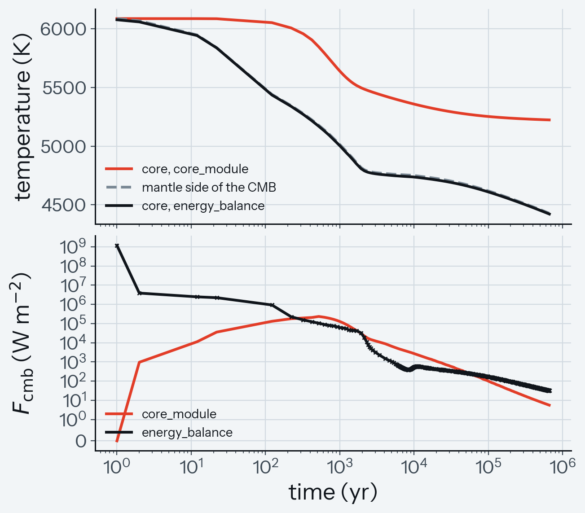

**Figure 18.** A coupled PROTEUS run to mantle solidification with the `core_module` and the `energy_balance` core boundary conditions. (a) Core temperature in both runs and the mantle side of the CMB, which cools alike in both. (b) CMB heat flux; crosses mark rows where the flux carries heat against the core-mantle temperature contrast.

Pinned by `tests/test_core_verification_page.py::test_coupled_tables_reproduce_the_page`, which recomputes these numbers from the tables; the runs themselves need PROTEUS and are not repeated by the test suite.

## 12. NumPy and JAX right-hand sides and the analytic Jacobian

The solver evaluates the coupled right-hand side in NumPy and, for CVODE's analytic Jacobian, in JAX; the two must agree, and the JAX Jacobian must equal the derivative of that right-hand side. On a 10-node mesh with the core in three states (inside the growth band, 100 K above the onset, and stratified with the core 50 K above the mantle), the two right-hand sides agree to 1.4e-12<!--k:12.rhs_max_rel_nucleating--> in every component, the shell cells of the stratified state included. The analytic $\partial \dot T_\mathrm{core}/\partial T_\mathrm{core}$ matches a central difference to 3.0e-11<!--k:12.jac_tcore_min_rel_nucleating--> in the growth band and 6.3e-11<!--k:12.jac_tcore_min_rel_stratified--> with the layer, at the step that balances truncation and rounding; above the onset the core is colder than the mantle base, the flux is on its linear conduction branch, and the difference stays at rounding for every step.

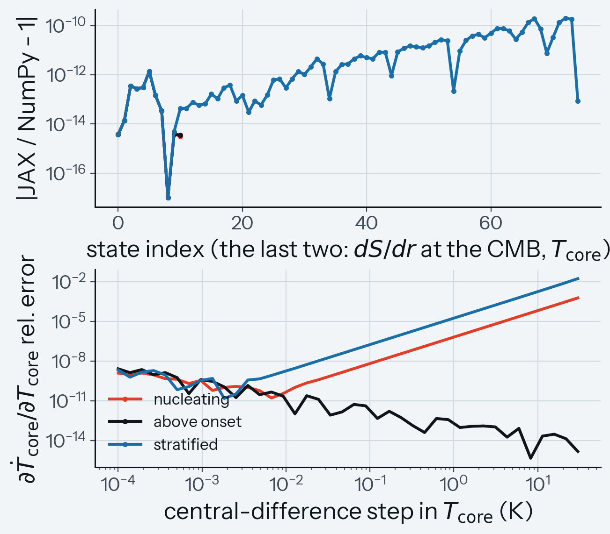

**Figure 19.** Agreement of the NumPy and JAX core right-hand sides. (a) Relative difference per state component, the entropy cells first and the CMB entropy gradient and core temperature last, in three core states. (b) Relative error of a central difference of $\dot T_\mathrm{core}$ against the analytic Jacobian entry, against the difference step.

Pinned by `tests/test_jax_dsdt_core_module.py::test_boundary_slots_match_numpy_on_a_five_node_mesh`, `::test_jacobian_core_column_matches_central_differences` and `::test_jacobian_carries_boundary_couplings`.

## 13. Stable layer against thermal_history

The resolved layer of `stratification = true` is compared with the `leeds_thermal` model of thermal_history (Greenwood et al. 2021) on the core of section 6, which starts on the adiabat at a CMB temperature of 4400<!--k:13.t_cmb_start_K--> K. aragog resolves the outer core above 0.4<!--k:13.shell_base_fraction--> $r_\text{cmb}$ in 64<!--k:13.shell_cells--> cells with the default mixing constants; mixing acts only where the temperature falls outward faster than the adiabat, so a subadiabatic region conducts only. `leeds_thermal` instead moves the base of its layer by a stability check after each step. The layer depth is defined the same way on both sides: the depth below the CMB where the excess over the convecting adiabat falls to 0.1 of its value at the top, which for aragog is the centre of its top cell.

The conducted adiabatic flow at the CMB is 15.8<!--k:13.q_k_TW--> TW. Under a CMB flow below it, the top of the core takes up more heat by conduction along the adiabat than the CMB removes, and a warm stable layer forms; the CMB removes 8 or 12 TW, adds 2 TW, or removes nothing. Under a flow above it, an existing layer erodes. In the four cases with a fixed flow, until the inner core of `leeds_thermal` forms at 588<!--k:13.leeds_onset_first_myr--> Myr, its centre temperature differs by at most 0.33<!--k:13.leeds_tcen_flow_spread_K--> K between the flows and its layer depth from 200<!--k:13.leeds_depth_settled_from_myr--> Myr on by at most 1.4<!--k:13.leeds_depth_flow_spread_rel:100--> %; the CMB temperature depends on the flow throughout.

aragog integrates the convecting core and the shell alone with SciPy BDF at a relative tolerance of 1e-11<!--k:13.rtol-->. Between runs at 1e-11<!--k:13.rtol--> and 1e-12<!--k:13.rtol_tight--> the centre temperature differs by at most 0.13<!--k:13.tcen_max_rtol_noise_K--> K. At a relative tolerance of 1e-8<!--k:13.rtol_loose--> the comparison has not converged: the centre temperature then differs from thermal_history by up to 13.5<!--k:13.tcen_max_abs_diff_K_rtol1e-8--> K and the inner-core onset by up to 32<!--k:13.onset_max_abs_diff_myr_rtol1e-8--> Myr. The heat rates of the core and the shell sum to the CMB flow at every sample to 5.0e-16<!--k:13.erosion_identity--> of the conducted adiabatic flow or better, in every case; this is a property of the discretisation (the shell fluxes telescope and the core uses one effective capacity), not of the integration.

| CMB flow | max $\lvert\Delta T_\text{cmb}\rvert$ (K) | max $\lvert\Delta T_\text{cen}\rvert$ (K) | depth ratio | onset aragog (thermal_history) (Myr) | $r_\text{icb}$ at 999 Myr |
|---|---|---|---|---|---|
| 8 TW | 2.88<!--k:13.tcmb_max_abs_diff_K_8TW--> | 0.63<!--k:13.tcen_max_abs_diff_K_8TW--> | 0.79<!--k:13.layer_ratio_min_8TW--> to 1.13<!--k:13.layer_ratio_max_8TW--> | 590<!--k:13.onset_myr_aragog_8TW--> (588<!--k:13.onset_myr_leeds_8TW-->) | 0.20<!--k:13.ricb_end_rel_diff_8TW:100--> % |
| 12 TW | 2.23<!--k:13.tcmb_max_abs_diff_K_12TW--> | 0.61<!--k:13.tcen_max_abs_diff_K_12TW--> | 0.82<!--k:13.layer_ratio_min_12TW--> to 1.39<!--k:13.layer_ratio_max_12TW--> | 589<!--k:13.onset_myr_aragog_12TW--> (588<!--k:13.onset_myr_leeds_12TW-->) | 0.05<!--k:13.ricb_end_rel_diff_12TW:100--> % |
| -2 TW | 4.11<!--k:13.tcmb_max_abs_diff_K_-2TW--> | 1.01<!--k:13.tcen_max_abs_diff_K_-2TW--> | 0.79<!--k:13.layer_ratio_min_-2TW--> to 1.01<!--k:13.layer_ratio_max_-2TW--> | 592<!--k:13.onset_myr_aragog_-2TW--> (589<!--k:13.onset_myr_leeds_-2TW-->) | 0.23<!--k:13.ricb_end_rel_diff_-2TW:100--> % |
| 0 TW | 3.88<!--k:13.tcmb_max_abs_diff_K_0TW--> | 0.92<!--k:13.tcen_max_abs_diff_K_0TW--> | 0.79<!--k:13.layer_ratio_min_0TW--> to 1.01<!--k:13.layer_ratio_max_0TW--> | 591<!--k:13.onset_myr_aragog_0TW--> (589<!--k:13.onset_myr_leeds_0TW-->) | 0.15<!--k:13.ricb_end_rel_diff_0TW:100--> % |

For the four fixed flows the bounds are 5 K on the CMB temperature, 10 K on the centre temperature, a factor of 1.5 on the layer depth where both layers are thicker than 10 km after the first Myr, 2 % on the inner-core radius at the last sample (999<!--k:13.fixed_end_myr--> Myr) and 5 % on its onset time. The extremes of the depth ratio fall in the first 51<!--k:13.depth_ratio_extremes_last_myr--> Myr, while the layer is thin; from 300<!--k:13.depth_late_from_myr--> Myr on the two depths agree to within 1.6<!--k:13.depth_late_max_rel:100--> % (Figure 20a). The CMB temperature difference reaches its largest value between 36<!--k:13.tcmb_max_diff_myr_first--> and 69<!--k:13.tcmb_max_diff_myr_last--> Myr, with aragog colder. aragog reports its top cell as the CMB temperature; the centre of that cell lies 1000<!--k:13.top_cell_depth_m--> m below the CMB, where the adiabat of the starting core is 0.80<!--k:13.top_cell_offset_K--> K above the CMB temperature, so aragog starts that much warmer.

In the erosion case the CMB flow is 8<!--k:13.erosion_base_flow_TW--> TW to 50<!--k:13.erosion_start_myr--> Myr, 25<!--k:13.erosion_flow_TW--> TW to 150<!--k:13.erosion_fall_myr--> Myr and 8 TW again to 400<!--k:13.erosion_last_segment_end_myr--> Myr. The two models remove the layer in different ways. In aragog the face below the top cell mixes within the first Myr of the higher flow (at 51<!--k:13.erosion_cmb_mixed_myr_aragog--> Myr), and a mixed region then grows down from the CMB over the remaining stable part until the whole shell mixes at 92<!--k:13.erosion_removed_myr_aragog--> Myr; the heat stored in the shell at 50<!--k:13.erosion_start_myr--> Myr, 1.22e+28<!--k:13.erosion_stored_J--> J, drains through the excess of the CMB flow over the conducted adiabatic flow, 9.31<!--k:13.erosion_drain_TW--> TW on average, in 41.7<!--k:13.erosion_drain_myr--> Myr against the 42<!--k:13.erosion_mixing_myr--> Myr from 50<!--k:13.erosion_start_myr--> to 92<!--k:13.erosion_removed_myr_aragog--> Myr. In `leeds_thermal` the layer at the CMB conducts until its excess over the adiabat at the top reaches zero at 65<!--k:13.erosion_removed_myr_leeds--> Myr, where its depth at 0.1 of that excess vanishes; its stability check removes the layer base at 66<!--k:13.erosion_rs_removed_myr_leeds--> Myr. The CMB temperature during erosion is a model difference, without a bound: from the rise of the flow aragog's mixed top stays warmer than the conducting top of `leeds_thermal`, by up to 19.6<!--k:13.erosion_tcmb_max_diff_K_both_layers--> K at 65<!--k:13.erosion_tcmb_max_diff_myr--> Myr, when the top excess of `leeds_thermal` reaches zero, and from 92<!--k:13.erosion_removed_myr_aragog--> Myr until the flow falls at 150<!--k:13.erosion_fall_myr--> Myr the two CMB temperatures stay 4.75<!--k:13.erosion_tcmb_offset_K_after--> K apart (varying by 0.003<!--k:13.erosion_tcmb_offset_spread_K_after--> K), an offset that forms during erosion. Once its shell has mixed completely, aragog's centre temperature stays within 0.003<!--k:13.erosion_tcen_self_max_K--> K of that of aragog without a layer under the same flows until the flow falls, against 9.06<!--k:13.erosion_tcen_self_at_start_K:-1--> K below it at the rise of the flow, so the heat stored in the shell returns to the convecting core. The centre temperatures of aragog and `leeds_thermal` differ by up to 5.43<!--k:13.erosion_tcen_max_abs_diff_K--> K. After the flow falls back to 8 TW a new layer forms in both models, 702<!--k:13.erosion_depth_km_end_aragog--> km deep in aragog and 710<!--k:13.erosion_depth_km_end_leeds--> km in `leeds_thermal` at 399<!--k:13.erosion_end_myr--> Myr (Figure 20e, f). This comparison runs on SciPy BDF; in the solver, an eroding layer stalls CVODE at its default tolerances (see [the core boundary condition](core_bc.md)).

The two mixing constants are a model uncertainty, not a fitted quantity. Changing `layer_k_mix` or `layer_g_mix` by a factor of 10 either way changes the centre temperature of the 8 and 12 TW cases by at most 0.45<!--k:13.mixing_tcen_max_K--> K, against the 0.13<!--k:13.tcen_max_rtol_noise_K--> K between the two tolerances above, and their layer depth by at most 1.0<!--k:13.mixing_depth_max_rel:100--> %; the time at which the eroding shell mixes completely moves by 0<!--k:13.mixing_removal_max_myr--> Myr at the sampling of the reference table.

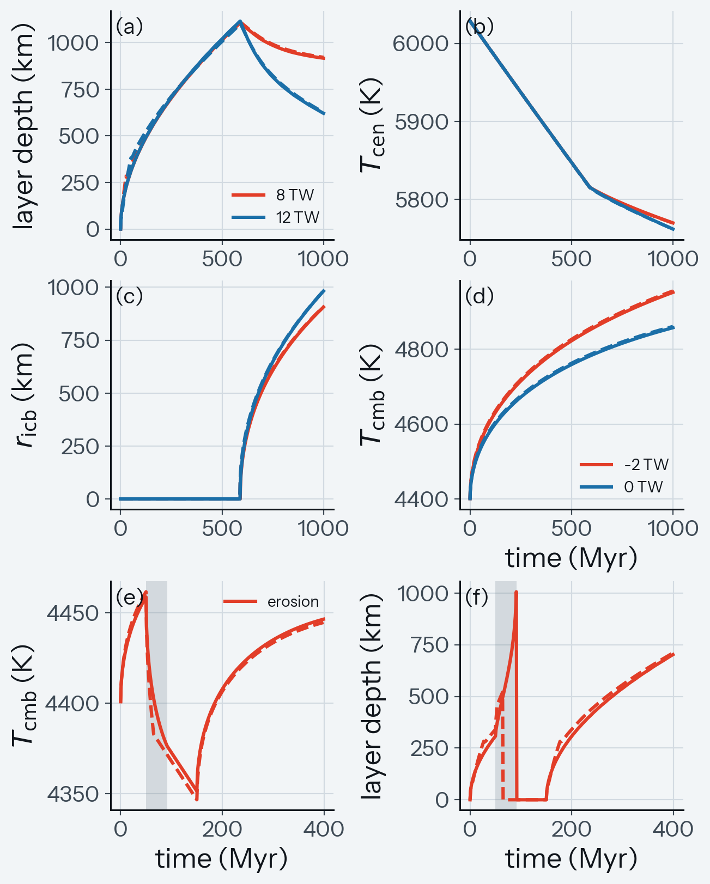

**Figure 20.** The resolved stable layer of aragog (solid) against the `leeds_thermal` model of thermal_history (dashed). (a) Layer depth at 0.1 of the top excess over the adiabat, (b) centre temperature and (c) inner-core radius under a CMB flow of 8 and 12 TW to 999<!--k:13.fixed_end_myr--> Myr; (d) CMB temperature under -2 and 0 TW. (e) CMB temperature and (f) layer depth in the erosion case to 399<!--k:13.erosion_end_myr--> Myr; the shaded window runs from the rise of the flow at 50<!--k:13.erosion_start_myr--> Myr to the time aragog's shell mixes completely, and aragog's depth is not drawn while the mixing acts below its top cell, where the depth at 0.1 of the top excess has no meaning.

Pinned by `tests/test_core_verification_page.py::test_the_stable_layer_meets_the_thermal_history_bounds`; the analytic limits of the shell by `tests/test_core_layer.py::test_a_young_layer_follows_the_erfc_solution_of_a_half_space`, `::test_a_steady_layer_reaches_the_quasi_static_depth` and `::test_mixing_keeps_a_superadiabatic_shell_on_the_adiabat`; a resumed solve by `tests/test_entropy_solver_core_module_smoke.py::test_a_resume_restarts_the_shell_where_the_previous_solve_ended`.

## References

- Anzellini, S., Dewaele, A., Mezouar, M., Loubeyre, P., & Morard, G. (2013). Melting of iron at Earth's inner core boundary based on fast X-ray diffraction. *Science*, 340(6131), 464-466. https://doi.org/10.1126/science.1233514
- Christensen, U. R., Holzwarth, V., & Reiners, A. (2009). Energy flux determines magnetic field strength of planets and stars. *Nature*, 457(7226), 167-169. https://doi.org/10.1038/nature07626
- Foley, B. J., & Driscoll, P. E. (2016). Whole planet coupling between climate, mantle, and core: Implications for rocky planet evolution. *Geochemistry, Geophysics, Geosystems*, 17(5), 1885-1914. https://doi.org/10.1002/2015GC006210
- Greenwood, S., Davies, C. J., & Mound, J. E. (2021). On the evolution of thermally stratified layers at the top of Earth's core. *Physics of the Earth and Planetary Interiors*, 318, 106763. https://doi.org/10.1016/j.pepi.2021.106763
- Labrosse, S., Poirier, J.-P., & Le Mouël, J.-L. (2001). The age of the inner core. *Earth and Planetary Science Letters*, 190(3-4), 111-123. https://doi.org/10.1016/S0012-821X(01)00387-9
- Nimmo, F. (2015). Energetics of the Core. In *Treatise on Geophysics* (2nd ed., Vol. 8, pp. 27-55). Elsevier. https://doi.org/10.1016/B978-0-444-53802-4.00139-1
- Nimmo, F. (2015). Thermal and Compositional Evolution of the Core. In *Treatise on Geophysics* (2nd ed., Vol. 9, ch. 9.08, pp. 201-219). Elsevier. https://doi.org/10.1016/B978-0-444-53802-4.00160-3
- Thiriet, M., Breuer, D., Michaut, C., & Plesa, A.-C. (2019). Scaling laws of convection for cooling planets in a stagnant lid regime. *Physics of the Earth and Planetary Interiors*, 286, 138-153. https://doi.org/10.1016/j.pepi.2018.11.003
