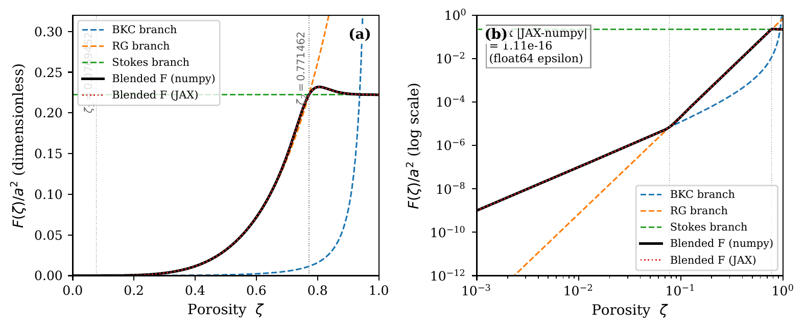
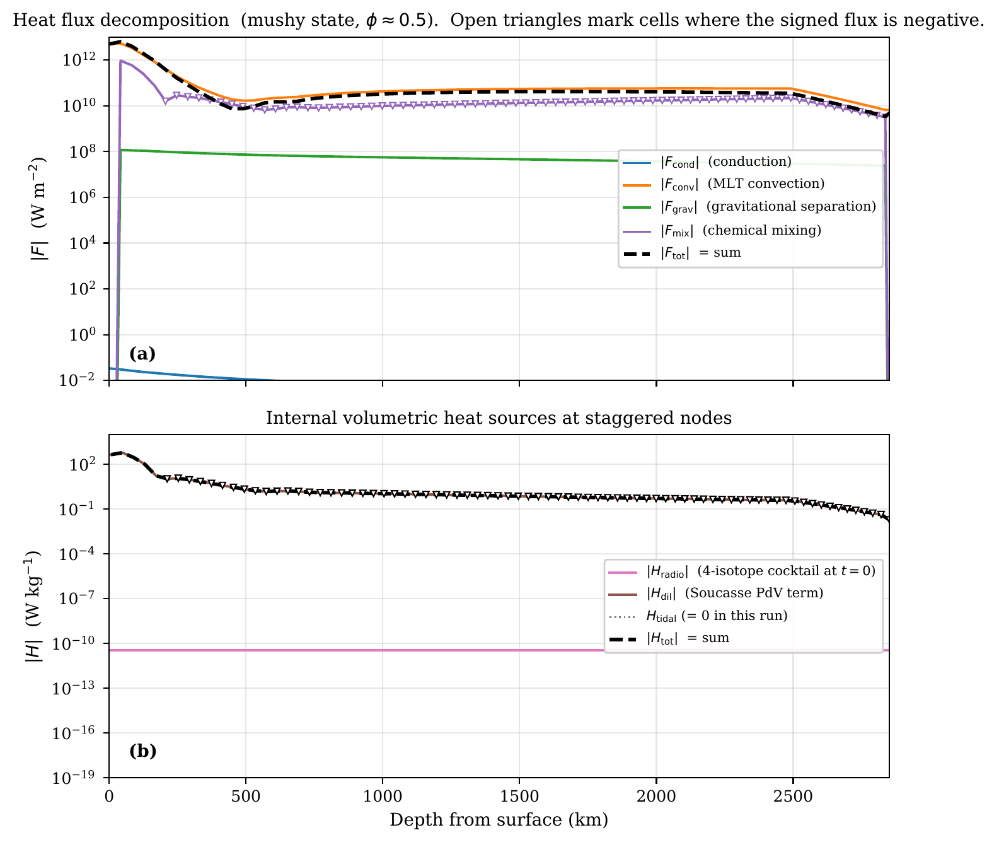

# Heat transport

Aragog assembles the total radial heat flux at each basic node from four independently configurable contributions:

$$
F_\mathrm{tot} = F_\mathrm{cond} + F_\mathrm{conv} + F_\mathrm{grav} + F_\mathrm{mix}.
$$

Each term is gated by a boolean in the `[energy]` section (`conduction`, `convection`, `gravitational_separation`, `mixing`); a flux that is disabled is identically zero. Internal heating sources (radiogenic, tidal) are documented separately in [Energy equation](energy_equation.md).

All flux formulas below use the entropy gradient $\partial S/\partial r$ as the primary driver. Temperature, density, heat capacity, thermal expansivity, and the isentropic temperature gradient $(\partial T/\partial P)_S$ are looked up from the EOS at $(P, S)$ on every RHS evaluation.

## Conduction

The Fourier flux is rewritten in entropy form using the thermodynamic identity $\partial T/\partial r |_S = (T/c_p)\,\partial S/\partial r$ and the EOS-tabulated isentropic temperature gradient:

$$
F_\mathrm{cond}
= -k\left[\frac{T}{c_p}\,\frac{\partial S}{\partial r} + \left.\frac{\partial T}{\partial P}\right|_S \frac{\partial P}{\partial r}\right].
$$

The pressure gradient is the configured profile (Adams-Williamson or external mesh file). When the entropy gradient vanishes (an isentropic profile) the conduction flux reduces to the adiabatic part alone, which is non-zero because the EOS provides $(\partial T/\partial P)_S$ directly. In the production path with PALEOS tables, $k$ is read from the EOS as a function of $(P, S)$; the `phase_solid.thermal_conductivity` and `phase_liquid.thermal_conductivity` config keys are kept only for the constant-properties analytical mode.

## Convection (mixing-length theory)

Convection is parameterised as eddy diffusion of entropy:

$$
F_\mathrm{conv} = \rho T \kappa_h \max\!\left(-\tfrac{\partial S}{\partial r},\ 0\right).
$$

The instability criterion is $\partial S/\partial r < 0$. The $\max(\cdot, 0)$ form is implemented as a smooth approximation (a $C^\infty$ ramp) so that the BDF Jacobian remains continuous through the onset of convection. There is no explicit "superadiabatic gradient" subtraction in the entropy formulation: the adiabat corresponds to $\partial S/\partial r = 0$, so the entropy gradient itself measures departures from the adiabat.

### Eddy diffusivity

$\kappa_h$ is the product of a mixing length $l(r)$ and a regime-dependent velocity scale. Following [Abe (1993)](https://scixplorer.org/abs/1993GMS....74...41A/abstract), Aragog blends the viscous and inviscid limits via a $\tanh$ on the cell Reynolds number:

$$
v_\mathrm{visc} = \frac{\alpha g\,(-\partial S/\partial r)\,T\,l^2}{18\,\nu},\qquad
v_\mathrm{inv} = l\left[\frac{\alpha g\,T\,(-\partial S/\partial r)}{c_p}\right]^{1/2},
$$

$$
\kappa_h = l\,[(1-w)\,v_\mathrm{visc} + w\,v_\mathrm{inv}],\qquad
w = \tfrac{1}{2}\Big[1 + \tanh\!\big((\mathrm{Re} - Re_\mathrm{crit})/\Delta\big)\Big],
$$

with $\mathrm{Re} = v_\mathrm{visc}\,l / \nu$, $Re_\mathrm{crit} = 9/8$, and a narrow blend width $\Delta = 0.01\,Re_\mathrm{crit}$. The narrow blend keeps inviscid mixing confined to the convecting regime; widening it leaks inviscid $\kappa_h$ into the solid phase and induces $T_\mathrm{core}$ bistability.

### Mixing length profile

| `mixing_length_profile` | Formula |
|-------------------------|---------|
| `"nearest_boundary"` | $l(r) = \min(r_\mathrm{top} - r,\ r - r_\mathrm{cmb})$ |
| `"constant"` | $l$ = configured fraction of mantle thickness |

### Phase-modulated floor

A phase-aware floor on $\kappa_h$ is set by `kappah_floor`:

$$
\kappa_h \;\to\; \max\!\big(\kappa_h,\ \kappa_h^\mathrm{floor}(\phi)\big),
$$

where $\kappa_h^\mathrm{floor}(\phi)$ is modulated by melt fraction so that the floor activates only in convectively suppressed solid regions. The thermal and chemical eddy diffusivities also accept independent scale factors:

| Key | Meaning |
|-----|---------|
| `eddy_diffusivity_thermal` | Multiplier on $\kappa_h$. Negative values pin $\kappa_h$ to the absolute value (SPIDER convention) |
| `eddy_diffusivity_chemical` | Multiplier on $\kappa_c$. Negative values pin $\kappa_c$ to the absolute value |

## Gravitational separation of melt

In the partially molten regime, melt and solid separate vertically by gravity. The mass flux is

$$
j_\mathrm{grav} = \rho\,\phi(1-\phi)\,v_\mathrm{rel}\,\mathrm{smth}(\phi),\qquad
v_\mathrm{rel} = \frac{(\rho_m - \rho_s)\,g\,K(\phi)}{\eta_m},
$$

with $K(\phi)$ a Stokes-or-Darcy permeability and $\eta_m$ the melt viscosity. The corresponding heat flux is

$$
F_\mathrm{grav} = j_\mathrm{grav}\,L(P),
$$

where $L(P)$ is the EOS-tabulated, pressure-dependent latent heat of fusion.

### Permeability $K(\zeta)$ across the three Abe regimes

**Figure 1.** The gravitational-separation permeability factor $F(\zeta) = K(\zeta)/a^2$ as a function of porosity. Dashed lines: the three regime branches considered individually, namely Blake-Kozeny-Carman (BKC), Rumpf-Gupte (RG), and Stokes settling, following [Abe (1993)](https://scixplorer.org/abs/1993GMS....74...41A/abstract). Solid black: the smooth tanh-blended composite that Aragog actually evaluates, with regime-switch porosities $\zeta_1=0.0769452$ (BKC to RG) and $\zeta_2=0.771462$ (RG to Stokes). (a) Linear axis showing the smooth crossover. (b) Log-log axis showing the BKC regime extending to vanishingly small porosity. The numpy and JAX implementations agree to within float-64 machine epsilon ($\max|\Delta F|=1.1\times 10^{-16}$ in absolute units).

### Phase-boundary smoothing

The smoothing function $\mathrm{smth}(\phi)$ vanishes outside the mushy band, keeping the flux differentiable at the solidus and liquidus. Two forms are configurable:

| `phase_smoothing` | Formula |
|-------------------|---------|
| `"tanh"` (default) | SPIDER-style two-branch $\mathrm{get\_smoothing}$ with width `matprop_smooth_width = 0.01`; $\mathrm{smth}(g\phi) \approx 1$ across $[0.05, 0.95]$ and ramps to 0 in narrow skirts at the solidus and liquidus |
| `"cubic_hermite"` | $\mathrm{smth}(g\phi) = 16\,g\phi^2(1 - g\phi)^2$ for $g\phi \in [0, 1]$ (intermediate-$\phi$ damping; fallback for residual EoS mismatch) |

Here $g\phi$ is the un-truncated two-phase fraction at the staggered cell below the basic-node interface. Without smoothing, a raw $\rho\phi(1-\phi)v_\mathrm{rel}$ flux drains the CMB cell off the EOS table edge in a single coupling step at first crystallisation.

### Bottom-up gating

When `bottom_up_grav_sep = true`, a SPIDER-parity bottom-up gate disables $j_\mathrm{grav}$ below the rheological transition until the solid fraction is interconnected. This prevents spurious upward percolation of the first solid grains and reflects the physics that melt cannot drain through a fully molten lower mantle.

## Chemical mixing of melt fraction

Chemical mixing acts as a diffusive flux that relaxes the entropy gradient toward the local lever-rule prediction. The SPIDER-parity bracket form is

$$
F_\mathrm{mix} = -\kappa_c\,\rho\,T_\mathrm{fus}\left[
\frac{\partial S}{\partial r}
- \left(\phi\,\tfrac{\partial S_\mathrm{liq}}{\partial P} + (1-\phi)\,\tfrac{\partial S_\mathrm{sol}}{\partial P}\right)\frac{\partial P}{\partial r}
\right]\mathrm{smth}(\phi).
$$

The bracketed expression is the entropy-gradient excess relative to the linear (lever-rule) interpolation between the solidus and liquidus entropy gradients at the local pressure. Outside the mushy band $\mathrm{smth}(\phi)$ vanishes and so does the flux. The chemical eddy diffusivity $\kappa_c$ is the same MLT diffusivity as $\kappa_h$ scaled by `eddy_diffusivity_chemical`.

The term enters the entropy equation as a heat flux: even though the flux carries melt mass (not energy directly), the latent heat associated with the redistributed melt is what shows up in the energy budget at staggered nodes.

## Internal heating

Internal heating contributes to the entropy equation through the source term $\rho H$ in the integral balance. Two contributions are tracked; the radiogenic-decay model and the per-isotope configuration are discussed in [Energy equation](energy_equation.md). Per-call energy integrals (`step_dE_Q_radio_J`, `step_dE_Q_tidal_J`) are documented in [Energy diagnostics](energy_diagnostics.md).

- **Radiogenic.** $H_\mathrm{radio} = \sum_i \chi_i \varphi_i \exp(-\ln 2\,(t - t_0)/\tau_{1/2,i})$, time-dependent and (typically) space-uniform.
- **Tidal.** Per-staggered-node array supplied through `tidal_array`; broadcast scalar or length-$N$ array.

The volumetric work done when melt of different density is transported across a pressure gradient is *not* added as an explicit volumetric source. By definition the enthalpy contrast $\Delta h = \Delta u + P\,\Delta v$, and on a hydrostatic column $\partial \Delta h/\partial r \supset \Delta v\,\partial P/\partial r = -\rho g\,\Delta v$, so $-\partial/\partial r(j\,\Delta h) \supset +\rho g\,\Delta v\,j$ already carries the same quantity through the divergence of the $\Delta h$-weighted mass-flux contributions to `_heat_flux`. Adding it explicitly would double-count ([Bower et al. (2018)](https://scixplorer.org/abs/2018PEPI..274...49B/abstract) §3, SPIDER `energy.c`).

## Per-component flux output

The basic-node flux contributions are exposed individually on `SolverOutput`:

| Field | Component |
|-------|-----------|
| `jcond_b` | $F_\mathrm{cond}$ |
| `jconv_b` | $F_\mathrm{conv}$ |
| `jgrav_b` | $F_\mathrm{grav}$ |
| `jmix_b` | $F_\mathrm{mix}$ |
| `heat_flux` | $F_\mathrm{tot}$ |
| `dSdr_b` | $\partial S/\partial r$ at basic nodes |

Per-staggered-node heating is in `heating` (sum of the two contributions); per-component arrays are exposed via `heating_radio` and `heating_tidal`.

### Decomposition on a fully-mushy state

**Figure 2.** (a) Magnitude of the four heat-flux components $F_\text{cond}$, $F_\text{conv}$, $F_\text{grav}$, $F_\text{mix}$ and their sum on an 80-cell Earth mesh, evaluated at a fully-mushy state where the entropy on each cell is the midpoint of the local solidus and liquidus values plus a small surface-ward gradient. Open triangles mark cells where the signed flux is negative. The four components reconstruct $F_\text{tot}$ to floating-point round-off ($\max|F_\text{tot}-\sum F_i|/|F_\text{tot}| < 10^{-15}$). (b) Internal volumetric heating sources $H_\text{radio}$, $H_\text{tidal}$ at the staggered nodes for the same state, with the bundled radionuclide cocktail at $t=0$.
