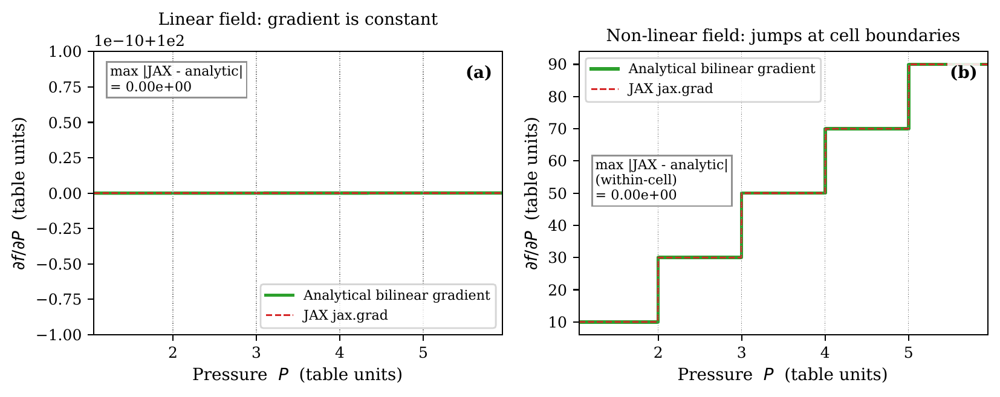
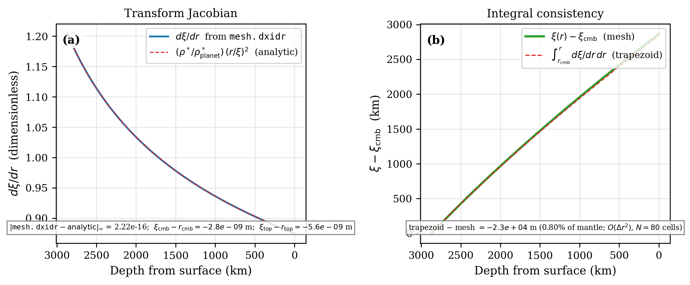
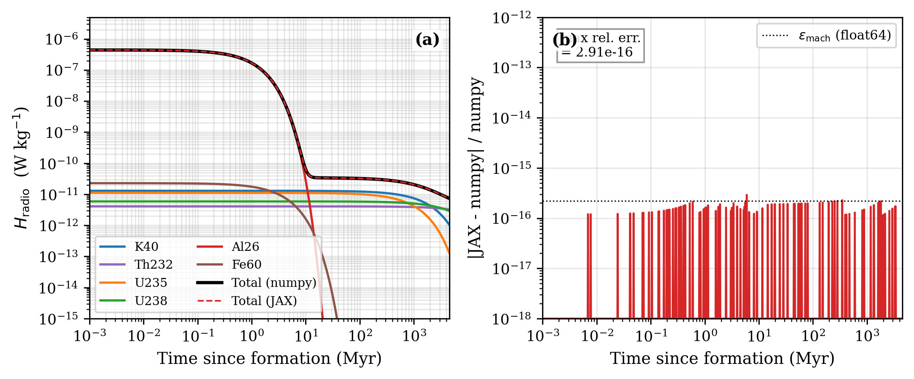
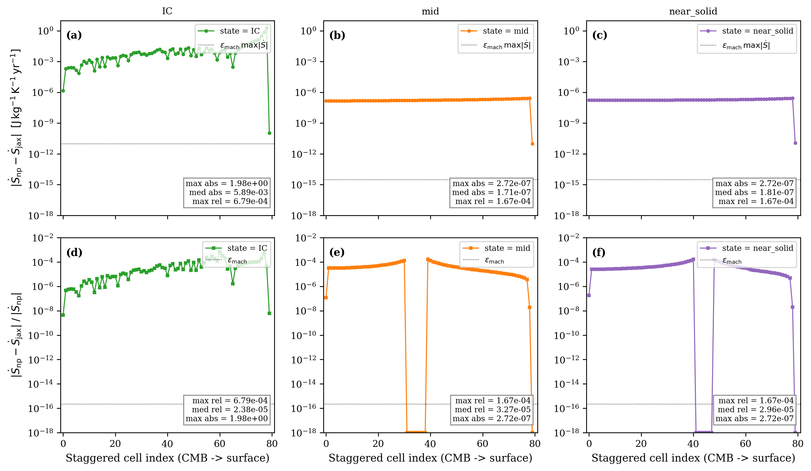
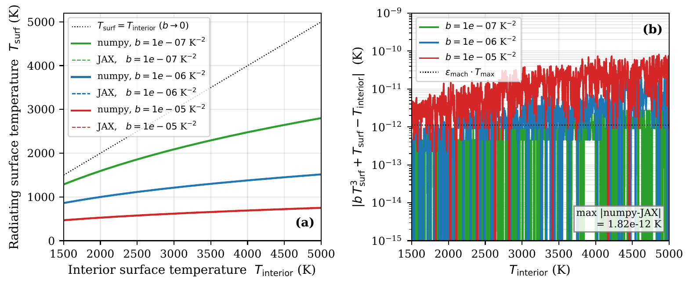

# First-principles verification

Aragog ships a verification test suite that exercises the entropy solver against analytic limits, conservation laws, and SPIDER-parity references. The suite runs under `pytest` from the repository root and is the primary way to confirm a build is correct.

## Test categories

The tests are organised by the layer they cover:

### EOS unit tests (`tests/test_entropy_pytest.py`)

Exercise `EntropyEOS` and `EntropyPhaseEvaluator`:

- Property lookups (temperature, density, heat capacity, thermal expansivity, isentropic temperature gradient) at on-grid and off-grid $(P, S)$ points.
- Solidus and liquidus entropy lookups against the reference `solidus_P-S.dat` and `liquidus_P-S.dat` files.
- Smooth-clipped melt fraction $\phi(P, S)$: monotone in $S$, clamped to $[0, 1]$, $C^\infty$ across the solidus and liquidus crossings.
- The two-stage SPIDER-parity blend (cubic-Hermite or tanh smoothing followed by `combine_matprop`) for density, heat capacity, and viscosity.
- The latent-blend $c_p$ method against the linear blend.



**Figure 1.** JAX-traced bilinear interpolation of the EOS table reproduces the numpy reference to float-64 machine precision and supplies finite, non-zero derivatives via `jax.jacrev` at on- and off-grid $(P, S)$ points. The agreement is the prerequisite for the analytic Jacobian path used by CVODE.

### Phase evaluator tests

Test the SPIDER-parity behaviour of `EntropyPhaseEvaluator`:

- Phase identification at $(P, S)$ in pure solid, pure liquid, and mushy regimes.
- Viscosity tanh blend across the rheological transition $\phi_\mathrm{rheo}$.
- Gravitational-separation velocity in viscous and inviscid regimes.
- Pressure-dependent latent heat $L(P) = T_\mathrm{liq}(P) [S_\mathrm{liq}(P) - S_\mathrm{sol}(P)]$.

### Solver integration tests

Drive `EntropySolver` through short integrations and check the resulting profiles:

- Standalone grey-body cooling: a fully-molten initial state cools toward the equilibrium temperature without status flag failures.
- The `set_initial_entropy`, `set_initial_dSdr_cmb`, and `set_initial_core_temperature` paths produce the expected state-vector layouts for `quasi_steady`, `energy_balance`, and `bower2018` modes.
- The retry-ladder hooks (`get_current_dSdr_cmb`, `_atol_sf`) round-trip cleanly.

### Conservation tests (`tests/test_entropy_verification.py`)

The conservation tests are the strongest class of verification because they hold under any valid run, not just specific test scenarios:

- **Energy conservation.** $E_\mathrm{th}$ change over a closed integration matches the time-integrated surface flux to within solver tolerance.
- **Mass conservation.** Mantle mass remains constant through phase changes.
- **Grey-body cooling.** Surface flux follows $\varepsilon\sigma(T_\mathrm{top}^4 - T_\mathrm{eqm}^4)$ within tolerance once the radiative regime is established.



**Figure 2.** Mass-coordinate mesh Jacobian. The Newton solve that maps from mass coordinate to spatial radius (used when `mass_coordinates = true`) is monotone, smooth, and consistent with the analytic Adams-Williamson density profile. Departures here would propagate to mis-aligned cell volumes and a spurious mass-conservation residual in the integrator.



**Figure 3.** Radioactive heating $H_\mathrm{radio}(t)$ for the bundled isotope cocktail (Ruedas 2017): present-day specific powers ($^{40}\mathrm{K}$, $^{232}\mathrm{Th}$, $^{235}\mathrm{U}$, $^{238}\mathrm{U}$) decayed back to Solar System formation. Used as the source-term verification for the closed-mantle energy balance: the cumulative `step_dE_Q_radio_J` integral must match the time integral of $\rho \cdot H_\mathrm{radio}$ over each call to within solver tolerance.

### JAX path tests (`tests/test_jax_entropy.py`)

Verify that the JAX-backed `EntropyEOS_JAX` and `compute_fluxes` agree with the numpy path:

- EOS parity: `EntropyEOS_JAX` returns the same temperature, density, heat capacity, thermal expansivity, $\partial T/\partial P|_S$, and conductivity as `EntropyEOS` on the same $(P, S)$ inputs.
- Phase evaluator parity: the JAX two-stage blend matches `EntropyPhaseEvaluator` to within floating-point tolerance.
- JIT and `vmap` compatibility: the JAX flux assembly is differentiable end-to-end with `jax.grad`/`jax.jacrev` and survives JIT compilation without recompilation hot-spots.
- Boundary-copy tests: `dSdr` boundary values copy from the nearest interior node (SPIDER `ic.c:450` parity) instead of being extrapolated.
- Solver parity: integrating the same problem with the JAX-RHS-driven CVODE path and the numpy RHS produces matching trajectories.

### Numpy ↔ JAX RHS parity at representative magma-ocean states



**Figure 4.** Numpy $\leftrightarrow$ JAX RHS parity on an 80-cell Earth mesh at three representative magma-ocean states. *Top row, panels (a-c)*: per-cell **absolute** residual $|\dot S_\text{numpy} - \dot S_\text{jax}|$ in J/kg/K/yr; the dotted line is $\epsilon_\mathrm{mach}\,\max|\dot S|$ (the floating-point round-off floor expected on a single FP operation). *Bottom row, panels (d-f)*: per-cell **relative** residual $|\dot S_\text{numpy} - \dot S_\text{jax}|/|\dot S_\text{numpy}|$; the dotted line is float-64 machine epsilon. The three states are (a/d) initial condition (full magma ocean, $S \approx 3900$ J/kg/K, dimensionally uniform), (b/e) mid-solidification ($S = 3300 \to 3700$ J/kg/K from CMB to surface), (c/f) near-solid ($S = 3000 \to 3300$ J/kg/K).

Per-panel residuals:

- **Mid-solidification (b, e) and near-solid (c, f).** Interior cells sit at the float-64 round-off floor. Maximum absolute residual $\sim 3\times 10^{-7}$ J/kg/K/yr, dominated by a single spike at the surface boundary cell where the BC assembly is re-derived independently between numpy and JAX. Median relative error $\le 3\times 10^{-5}$.
- **Uniform-entropy IC (a, d).** Absolute residual $\sim 1$ J/kg/K/yr. Both paths run EOS lookup, lever-rule, and table interpolation on a uniform input; the arithmetic differs at the interpolation level. The relative error inflates because $|\dot S|$ itself is small in equilibrium.

Numpy and JAX paths are independent re-derivations, not a bit-exact port.



**Figure 5.** Surface-temperature correction from the upper-thermal-boundary-layer parameterisation (`solver/boundary.py::_utbl_tsurf`). The Cardano-formula solution to $b x^3 + x - T_\mathrm{int} = 0$ recovers $T_\mathrm{surf} < T_\mathrm{int}$ for the entire physical range and matches the cubic-equation residual to floating-point tolerance. Verifies the analytic surface boundary condition used when `param_utbl = true`.

### Mesh tests (`tests/test_jax_mesh_gravity_fallback.py`)

Verify that when the external mesh file (`eos_method = 2`) supplies an `eos_gravity` column, the JAX path interpolates the per-node gravity profile onto the basic grid rather than broadcasting a single scalar.

## Running the verification suite

The standalone suite uses `pytest`:

```sh
# Run the entire suite
pytest tests/

# Run a specific category
pytest tests/test_entropy_pytest.py
pytest tests/test_entropy_verification.py
pytest tests/test_jax_entropy.py

# Mark-filtered subsets
pytest -m unit tests/             # unit tests only
pytest -m smoke tests/            # smoke tests only
```

The JAX-path tests require `jax` and `equinox` to be installed; tests are skipped (not failed) when the optional dependencies are missing. Some tests also require the SPIDER-format EOS table directory; they skip if `FWL_DATA` is unset or does not contain the expected files.

## Physical constraints checked

The suite asserts the following physical invariants on every solver-driven test run:

1. **Temperature positivity.** $T > 0$ everywhere at all integration times. EOS lookups outside the table domain raise rather than silently extrapolating.
2. **Melt fraction bounds.** $0 \le \phi \le 1$ via the smooth-clip; the assertion runs at every staggered node.
3. **Pressure positivity and monotonicity.** $P(r)$ is positive and decreases monotonically from CMB to surface.
4. **Entropy gradient continuity.** $\partial S/\partial r$ and the resulting fluxes are $C^0$ across the solidus and liquidus crossings (the smoothing functions enforce this).
5. **Energy conservation.** Within the integrator tolerance, $\Delta E_\mathrm{th}$ matches the time-integrated boundary fluxes plus internal heating sources.
6. **Mass conservation.** Total mantle mass is preserved under gravitational separation and chemical mixing (the segregation flux is divergence-free in mass).
