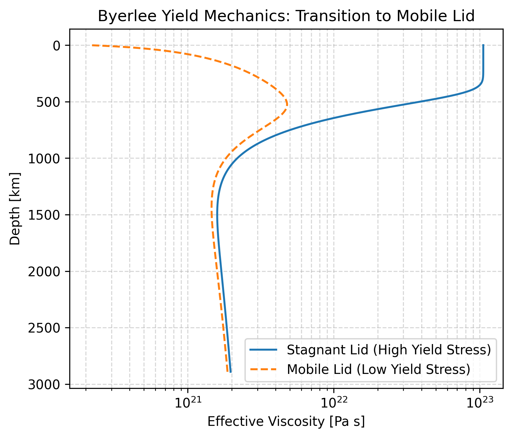
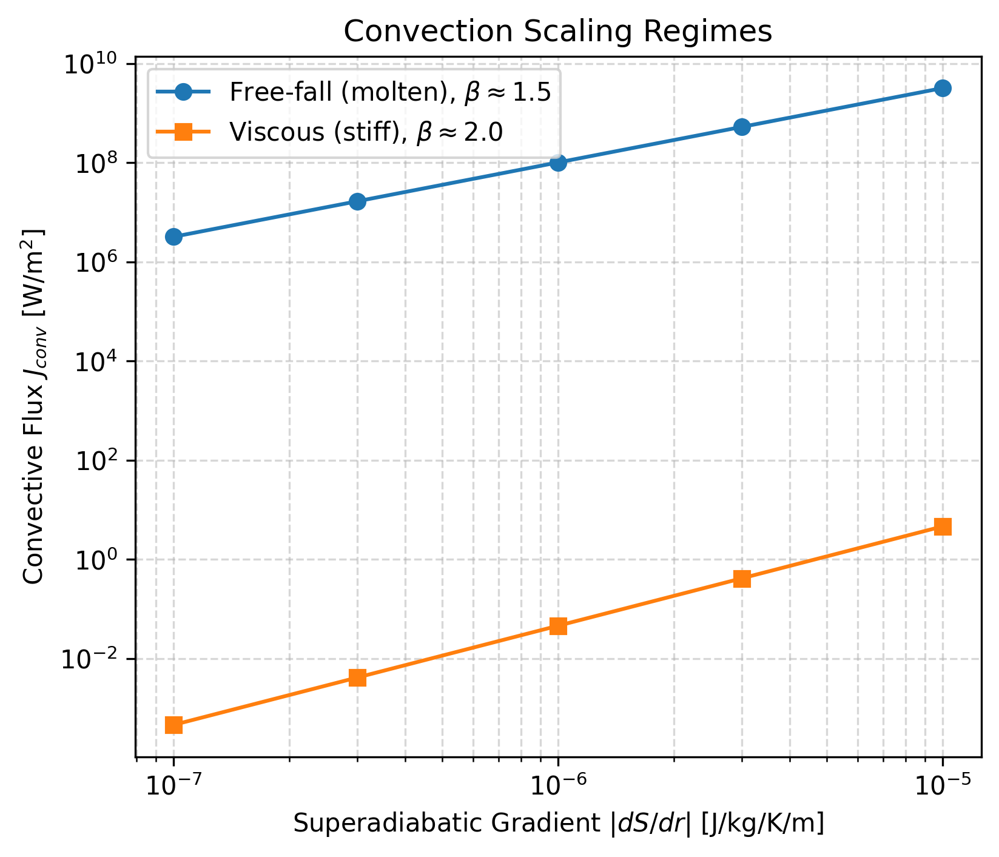

# Verification: Solid-state convection

We run deep-time verification tests to confirm the Arrhenius creep and global yielding parameterizations capture the physical behaviour of boundary layer models, such as the Tosi benchmark.

## Stagnant Lid Formation and Yielding Mechanics

A key discriminator of solid-state convection in terrestrial planets is the spontaneous formation of a stagnant lid: a cold, highly viscous thermal boundary layer at the surface that resists deformation, overlying a convecting interior.

With the solid-state parameterizations in `aragog`, the `global` stress closure mode computes the bulk strain rate in the lithosphere. This yields a boundary layer structure where the mantle remains adiabatic in the interior, and transitions to a conductive profile near the surface.

To verify the transition from a stagnant lid to a mobile lid, we test the solver against varying Byerlee yield stress limits. A high yield stress preserves a rigid, highly viscous surface boundary layer. Decreasing the yield stress forces the boundary layer to yield, dropping the effective viscosity by orders of magnitude and recovering a mobile-lid configuration.

## Nusselt-Rayleigh Convection Scaling

The mixing length theory (MLT) closure explicitly controls convective heat transport in the interior. We evaluate the resulting Nusselt-Rayleigh exponent ($\beta$) against established theoretical limits. The closure separates the flow into an inviscid (free-fall) regime and a viscous (Stokes-drag) regime, demarcated by a critical Reynolds number $\text{Re}_\text{crit} = 9/8$.

In the inviscid limit (molten rock), the closure recovers the classical free-fall scaling $\beta \approx 1.5$. In the viscous limit (solid rock), the closure isolates the Stokes drag, recovering the laminar scaling $\beta \approx 2.0$.

### Key Features Reproduced

1. **Analytical Exponents:** The internal solver recovers the theoretical Nu-Ra exponents for both the molten and solid limits precisely.
2. **Mobile Lid Transition:** The explicit yield surface smoothly transitions the boundary layer from a rigid stagnant lid to a fully decoupled mobile lid without numerical instability.
3. **Backend Parity:** Rigorous verification ensures exact float64 numerical parity between the high-performance JAX PDE kernels and the explicit NumPy reference closures in the full parameter space.

