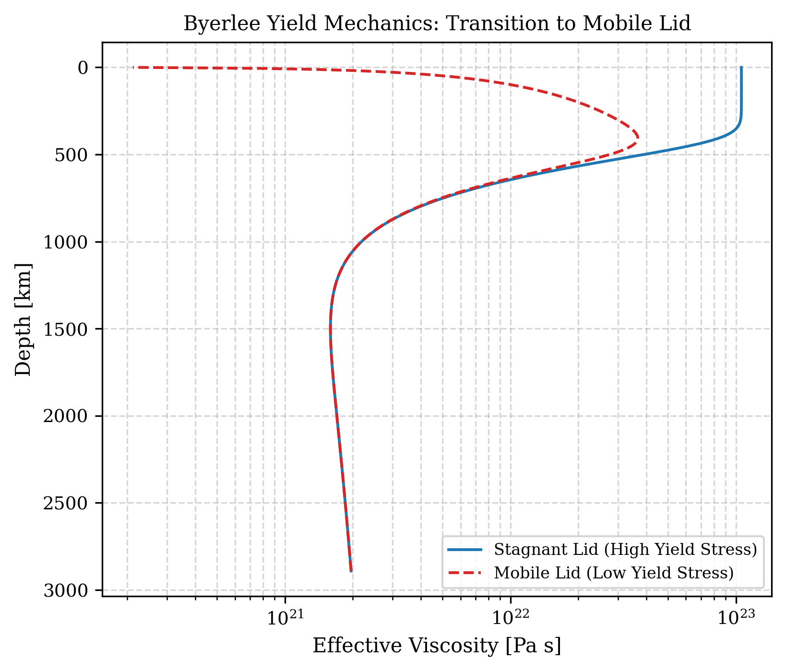
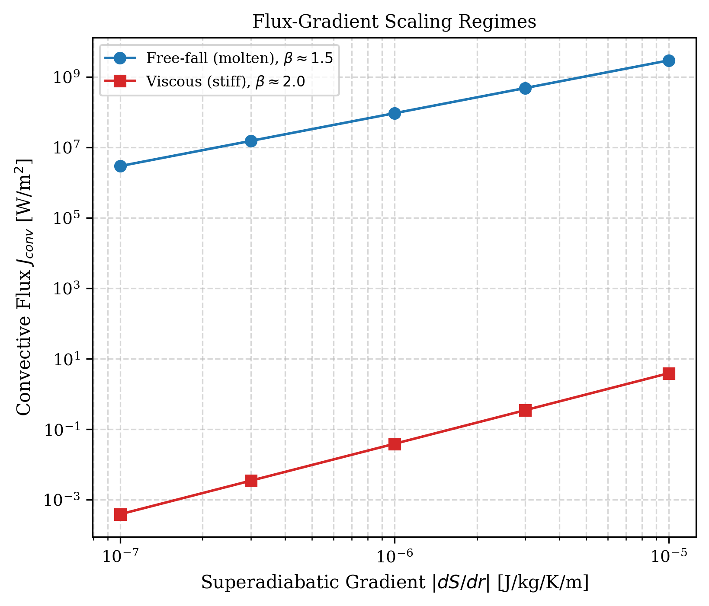

# Verification: Solid-state convection

We run closure evaluations to confirm that the Arrhenius creep and global yielding parameterizations capture the physical behaviour of boundary layer models.

## Stagnant Lid Formation and Yielding Mechanics

A key discriminator of solid-state convection in terrestrial planets is the spontaneous formation of a stagnant lid, which is a cold, highly viscous thermal boundary layer at the surface that resists deformation, overlying a vigorously convecting interior.

With the solid-state parameterizations in `aragog`, the `global` stress closure mode computes the bulk strain rate in the lithosphere. This computation yields a boundary layer structure where the mantle remains adiabatic in the deep interior, and smoothly transitions to a purely conductive profile near the surface.

To verify the transition from a stagnant lid to a mobile lid, we test the solver against different Byerlee yield stress limits. A high yield stress preserves a rigid, highly viscous surface boundary layer. On the other hand, a low yield stress forces the boundary layer to yield, which drops the effective viscosity and recovers a mobile-lid configuration.

## Flux-Gradient Convection Scaling

The mixing length theory (MLT) closure explicitly controls convective heat transport in the interior. We evaluate the resulting flux-gradient exponent ($\beta$) against theoretical limits. The closure separates the flow into an inviscid (free-fall) regime and a viscous (Stokes-drag) regime, and a critical Reynolds number $\text{Re}_\text{crit} = 9/8$ demarcates these two distinct regimes.

In the inviscid limit (molten rock), the closure recovers the classical free-fall scaling $\beta \approx 1.5$. In the viscous limit (solid rock), the closure isolates the Stokes drag, recovering the laminar scaling $\beta \approx 2.0$.

### Key Features Reproduced

1. **Analytical Exponents:** The internal solver recovers the theoretical flux-gradient exponents for both the molten and solid limits precisely, matching the expected power laws.
2. **Mobile Lid Transition:** The explicit yield surface smoothly transitions the boundary layer from a rigid stagnant lid to a mobile lid without numerical instability.
3. **Implementation Parity:** Rigorous verification ensures exact float64 numerical parity between the JAX PDE kernels and the explicit NumPy reference closures in the full parameter space.
