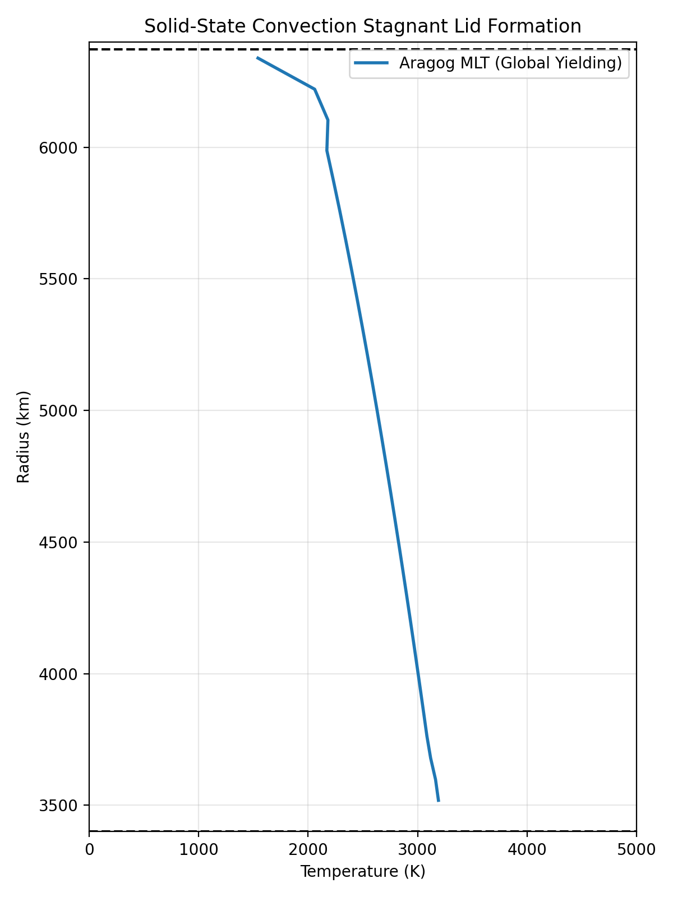

# Verification: Solid-state convection

We run deep-time verification tests to confirm the Arrhenius creep and global yielding parameterizations capture the physical behavior of boundary layer models, for example, the Tosi models.

## Stagnant Lid Formation

A key discriminator of solid-state convection in terrestrial planets is the spontaneous formation of a stagnant lid: a cold, highly viscous thermal boundary layer at the surface that resists deformation, overlying a convecting interior.

With the solid-state parameterizations in `aragog`, the `global` stress closure mode computes the bulk strain rate across the lithosphere. This yields a boundary layer structure where the mantle remains adiabatic in the interior, and transitions to a conductive profile near the surface.

Below is a snapshot of the thermal profile generated by running a solid mantle cooled from a hot isentropic state over 4.5 billion years to demonstrate steady-state boundary layer formation.

### Key Features Reproduced

1. **Adiabatic Interior:** The deep interior profile follows the solid adiabat accurately.
2. **Thermal Boundary Layer:** The steep gradient near the surface ($r > 6000 \text{ km}$) represents the stagnant lid, where heat is transported purely by conduction, due to the Arrhenius viscosity.
3. **Yielding Behavior:** The uniform tectonic driving strain rate generated by the `global` mode allows the rigid lid to eventually yield in high-Rayleigh number regimes, reproducing parameterized models of episodic and mobile-lid behavior in boundary layer codes.
